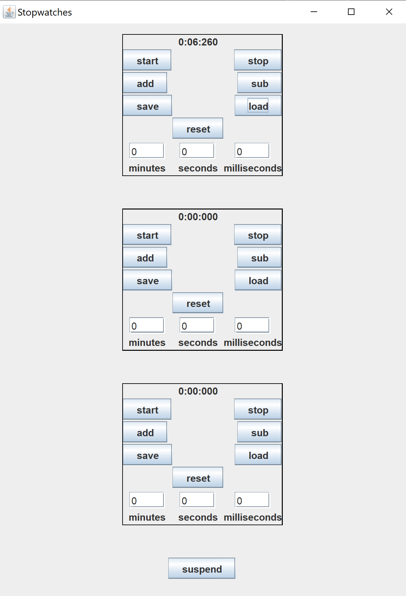
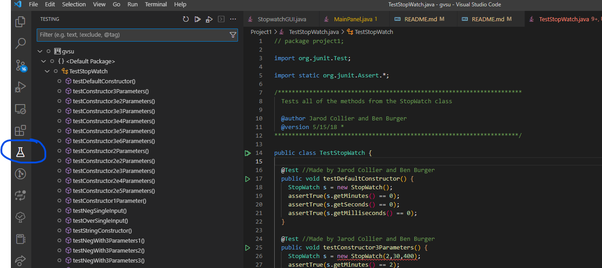

# Project1

## Preface from Jarod
I did this work with a partner and **neither of us were experienced coders at the time**. If you don't like how something is done, please feel free to delete it and try something else or architect the code differently. You could even use different files if you wanted to. You have complete freedom! This code is alright, it's not amazing. So don't be intimidated :D I love you, you've got this! <3
## Objective
Create a GUI that will hold 3 separate stopwatches that can run independently. Each stopwatch must be able to:

* start a timer 
* stop the timer
* reset the timer
* Add time to the timer. Specifically:
  * Minutes
  * Seconds
  * Milliseconds
* Subtract from the timer. Specifically:
  * Minutes
  * Seconds
  * Milliseconds
* Save the values from the timer off into a text file
* Load the values from the text file into the timer
* A global button that will pause all timers together

I have provided you some example code to get you started.

* StopwatchGUI.java 
  * This is the file you will run to create and use the GUI. You shouldn't need to edit this file at all. If for some reason the GUI doesn't size right on your screen, you can change this line:
  * `frame.setSize (800,800);`
* MainPanel.java
  * This file will be where you define your GUI. You will place the different elements on the GUI and then also define what happens when you touch the buttons. I have commented out parts of function calls that had my variables and replaced it with a generic name. I wanted the function calls to exist still so this wasn't as vague. This file is just for the whole GUI itself. It will be comprised of timers, which will be defined in the next file.
* TimerPanel.java
  * This file is where you will define how each timer appears and what the buttons will do. Many of the requirements mentioned above that are specific to each timer need to go in this file. 
* StopWatch.java
  * This will be your largest file most likely. It is where you will put all of your logic for how to handle your stopwatch. Get familiar with how it's organized and where it's called from other files. It is important to understand how all of these files connect. Hint: check  [line 32 of the TimerPanel.java file](TimerPanel.java#L32). Maybe also look at how this hyperlink is made for a good markdown reference :D

You will need to compile every file to get started. You can do that from the command line by doing this:

`javac *.java`

This will compile all files that end in `.java` because of the file system "wildcard" `*`. It's worth noting that I created a [.gitignore file](.gitignore) that will not commit all of the `*.class` files. It's good practice to not commit these, but just because you don't push them to git doesn't mean they are removed from your computer.

To execute the GUI, you'll then run:

`java StopwatchGUI` 

The GUI should then appear. You will probably want to create empty placeholders for the different buttons and fields that you'll need so it'll be easier to debug.

I am not sure what you'll want to start with first, I leave it up to you. In case you wanted to create the back end logic first, I did add a main method to the [StopWatch.java file](./StopWatch.java#L68) so you can compile and just run that one if you'd like. You can still compile everything at once with the above command, but you'll run the class file for StopWatch by doing:

`java StopWatch`

Both the "StopWatchGUI" and the "StopWatch" files should compile and be able to be run right away for you.

After everything is done, ou will need to test your code with unit tests to make sure it passes all cases.
I have my own unit test file that I am not putting in this repo yet because it's currently missing an import that I need to figure out later. But I have tests that would've passed everything asked of us. So we'll probably show you how to write your own tests to try to test your code and then we'll also run your finished product against my tests. 

Here is an example of what that finished GUI might look like in the end:

## How to test the code
Download the `junit.jar` file found here:

https://search.maven.org/search?q=g:junit%20AND%20a:junit

Download the `hamcrest.jar` file found here:

https://search.maven.org/artifact/org.hamcrest/hamcrest-core/1.3/jar

Move those files to a location on your computer that's easy to get to. Maybe in your coding folder? Something like `C:\Coding\lib`. The `lib` folder is short for "library" and often used to store such files. 

When you compile, you'll need to add these `.jar` files to your "classpath". This basically tells the compiler where to look for extra files. In an example that worked for me, you could do:

`javac -cp "../lib/junit-4.13.2.jar;../lib/hamcrest-core-1.3.jar" *.java`

This assumes you're running `javac` out of the location of the `*.java` files for your project. You might need to adjust the paths accordingly. Note that there is a `;` between the two `.jar` files in the classpath. If you were to run this in a command prompt and not bash shell, you'd need to change it to a `:`. This is just good information to know for how other projects might build their code. 

You know it'll work if you run it and it yells at you for a variety of the tests. If it says something about not finding `@Test`, something is still wrong. 

Once it compiles, you can run the tests like this:

`java -cp "../lib/junit-4.13.2.jar;../lib/hamcrest-core-1.3.jar" org.junit.runner.JUnitCore TestStopWatch`

Mine didn't compile, so I'm going off of what I see online and what worked for compiling. 

You also can use VS Code's testing options. They're honestly not bad. Go here:

Then you'll want to set up a test environment. You'll be able to run all tests or run individual tests by going to the file and clicking the green play button. You can run all tests by clicking the play to the right of the `TestStopWatch` icon in the test explorer.
